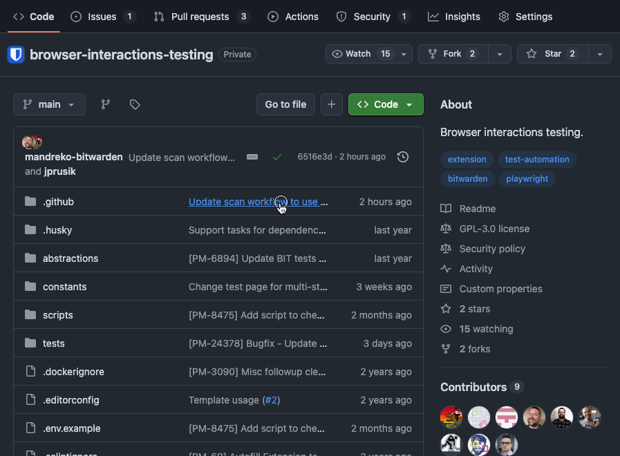
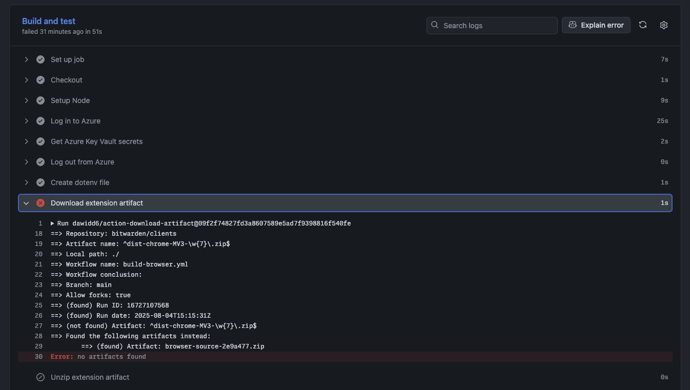

# Bitwarden BIT (Browser Interactions Testing)

This project leverages [Playwright](https://playwright.dev/) to run automated form-fill tests against real builds of the Bitwarden browser extension.

- [Bitwarden BIT (Browser Interactions Testing)](#bitwarden-bit-browser-interactions-testing)
  - [Goals and Intent](#goals-and-intent)
    - [Testing Philosophy](#testing-philosophy)
  - [Limitations](#limitations)
    - [Live tests](#live-tests)
  - [Requirements](#requirements)
  - [Quick start](#quick-start)
  - [Setup](#setup)
    - [Using Docker Compose](#using-docker-compose)
    - [Seeding Your Vault](#seeding-your-vault)
      - [Importing vault items (optional)](#importing-vault-items-optional)
  - [Running Tests](#running-tests)
  - [Feature flags](#feature-flags)
  - [Debugging and Updating Tests](#debugging-and-updating-tests)
    - [Debug Mode](#debug-mode)
    - [Headless Mode](#headless-mode)
    - [Execute only selected page tests](#execute-only-selected-page-tests)
    - [Start tests from a specific point](#start-tests-from-a-specific-point)
    - [Adding new tests](#adding-new-tests)
      - [Known failures](#known-failures)
  - [CI / CD](#ci--cd)
    - [Running actions](#running-actions)
    - [Actions Setup](#actions-setup)
    - [Using Github Secrets](#using-github-secrets)

## Goals and Intent

This project primarily serves to identify potential regressions of Bitwarden browser extension features that interact with a user's visited pages (e.g. injected content scripts). It achieves this by simulating common user journeys in controlled, static test scenarios (collected in our [pattern library](https://github.com/bitwarden/test-the-web)).

As a secondary concern, BIT aspires to track and anticipate feature compatibility breakage in popular live scenarios. To that end, BIT provides a "test bench" for debugging and developing improvements in the extension injected experiences.

### Testing Philosophy

- use the same login portals and experiences that users would
- test the duration of likely login experiences
- enable regular reporting and early notifications on experience breakages with the Bitwarden extension injected experiences
- in the case of live site tests, incur requests against live sites as little as possible:
  - no signing in
  - avoid traversing deeply into the site experience
  - any automation should be scheduled infrequently

## Limitations

- Extension builds can only be tested with Chromium clients at present.
- BIT can test the browser client builds against active feature flags, but only those supported by the server utilized by the [self-host image](https://github.com/bitwarden/self-host/releases/tag/v2025.7.2) (aka [Bitwarden Unified](https://bitwarden.com/help/install-and-deploy-unified-beta/)) found in the [Docker compose configuration](./docker-compose.yml). Because of release timings, this can mean some feature-flagged experiences available in the server will not immediately be available for testing in BIT (until the updated self-host image is released and updated in the Docker compose configuration).
  - Similarly the Bitwarden web client served and used with BIT is pinned to the self-host image version.

### Live tests

- Some live tests can be inconsistently flaky due to factors such as live experiments changing the received experience, external dependencies taking too long to load, ads/trackers, and general network instability.
  - Consequently, due to these factors, live site tests require more upkeep and may fall out of date more frequently.
- Some website prequalify emails/usernames before allowing password entry and/or use captchas in multi-step login flows. In these cases, we're typically only testing that the username/email was filled out properly.

## Requirements

- [git](https://git-scm.com/downloads)
- [node](https://nodejs.org/en)
- [Bitwarden CLI](https://bitwarden.com/help/cli/)
- [OpenSSL](https://www.openssl.org/)
- [NVM](https://github.com/nvm-sh/nvm#installing-and-updating) (optional, if not using nvm; manually manage your node version to `.nvmrc`)

## Quick start

> Note: Docker is required for quick start

- Install the requirements listed above
- From the project root, run `cp .env.example .env` and update the `.env` values per the commented notes in the file.
- If NVM is installed, run `nvm install`.
- Next run `npm run setup:all`, entering your system password when prompted.
- Run static tests with `npm run test:static`.

## Setup

- Create an `.env` file in the root directory with values pointing to the vault you want to test against (use `.env.example` as guidance) and populate it with your desired values

> Important! Once you've generated installation and crypto values for your `.env` file, DO NOT CHANGE the seeding values (`VAULT_EMAIL`, `VAULT_PASSWORD`, `KDF_ITERATIONS`). Doing so requires regenerating your installation and crypto secret values and rebuilding/updating server.

- Run `npm run setup:install` to generate and add installation values to your dotfile
  - Alternatively, you can generate them at `https://bitwarden.com/host` and add them to your dotfile manually as `BW_INSTALLATION_ID` and `BW_INSTALLATION_KEY`
- Run `npm run setup:crypto` to generate and add crypto values to your dotfile
  - Alternatively, you can create the required values manually with guidance from `https://bitwarden.com/help/bitwarden-security-white-paper/#hashing-key-derivation-and-encryption` and add them to your dotfile as `KDF_ITERATIONS`, `MASTER_PASSWORD_HASH`, `PROTECTED_SYMMETRIC_KEY`, `GENERATED_RSA_KEY_PAIR_PUBLIC_KEY`, and `GENERATED_RSA_KEY_PAIR_PROTECTED_PRIVATE_KEY`
- Install node (with `nvm install` if `nvm` is installed)
- Install Bitwarden CLI (with npm: `npm install -g @bitwarden/cli`)
- Do a clean-install with `npm ci` (this will also fetch and set up the Bitwarden clients repo)
  - If prompted, run `npx playwright install` as well
- Clone the clients repo and install its dependencies with `npm run setup:extension`
  - (Optional) Checkout the local `clients` to the branch with the version of the extension you want to test with (`main` by default)
- Build the extension to test against with `npm run build:extension` or build the production version of the extension with `npm run build:extension:prod`.
- For the targeted environment, configure the vault with the credentials you put in `.env`
- (Only once) Generate SSL certificates with `npm run setup:ssl`. These will be used by the web client, Bitwarden CLI, and Docker Compose
  - You should have two files in the root project folder: `ssl.crt` and `ssl.key` (or otherwise named in your `.env`)
- Add the Certificate Authority to your system's secure store:

  **Mac OS**

  ```shell
  sudo security add-trusted-cert -d -r trustRoot -k /Library/Keychains/System.keychain ssl.crt
  ```

  **Linux**

  ```shell
  sudo cp ssl.crt /usr/local/share/ca-certificates/ && sudo update-ca-certificates
  ```

### Using Docker Compose

Using Docker Compose will set up all the services required by the extension for testing. In order to use Docker Compose, you'll need to first:

Create and start the containers and volumes with `docker compose up -d --build --remove-orphans`, and teardown with `docker compose down -v`

### Seeding Your Vault

> If using Docker Compose to host the server environment (as described in the previous section), you may need to wait for the services within the `bitwarden` container to enter a running state before running any seeding scripts.

- Ensure that the [Bitwarden CLI](https://bitwarden.com/help/cli/) is installed and configured on your host machine. You will need to be running the [CLI Vault Management API](https://bitwarden.com/help/cli/#serve) server in order to seed the vault. You can start the server with `npm run start:cli` and stop it with `npm run stop:cli`
  - Use `npm run setup:vault` to set up your running, targeted vault (e.g. Docker container)
    - This command will handle creating a test account, logging in, setting up the CLI, running the Vault Management Server, seeding the vault with any new test credentials, and updating values that have changed. It will place those test credentials within a folder named `AutofillPlaywrightTestItems` in your vault.
  - If you have already created the test account in the vault, use `npm run seed:vault:ciphers` to only seed the vault with the test credentials.
  - If you need to completely delete/refresh any previously loaded test credentials run the command `npm run seed:vault:ciphers:refresh`

#### Importing vault items (optional)

You may import a vault in the form of a [Bitwarden-formatted JSON file](https://bitwarden.com/help/condition-bitwarden-import/). Place the file in the root of the project with the filename `vault.json` and run the command `npm run seed:vault:import`.

## Running Tests

- If targeting a local environment (not using the self-host image):
  - Ensure your targeted `API` and `Identity` services are configured and running (either [locally](https://contributing.bitwarden.com/getting-started/server/guide) or via Docker)
  - Ensure the Web Vault client is running (either with `npm run test:webserve` locally or via Docker)
    - Don't forget to [include your SSL key and cert file](https://contributing.bitwarden.com/getting-started/clients/web-vault/) in the `clients/apps/web` folder
- Run headless testing with `npm run test:static:headless`
- Run headed tests in debug mode with `npm run test:static:debug`
- Run only the public pages testing with `npm run test:public:debug`
- Test builds use the Manifest v3 version of the browser client by default; the v2 version can be built with `npm run build:extension:v2`
- Run accessibility (a11y) tests with `test:a11y:browser` or `test:a11y:web`. An a11y report will be generated for those respective clients.

## Feature flags

The Bitwarden documentation [describes how to make use of implemented feature flags](https://contributing.bitwarden.com/contributing/feature-flags/#local-configuration-json-file). Here, your flag key-value pairs can be added to the `flags.json` file. Note, changes to this file will require rebuilding the Docker image (e.g. `docker compose up -d --build --remove-orphans`).

## Debugging and Updating Tests

Several features are available for ease of testing/debugging

### Debug Mode

Pass the playwright flag `--debug` or use the provided npm scripts to run your tests in Debug Mode. While Debug Mode is active, additional information will be returned to console, tests will pause at various points until [the user selects the play button to continue](https://playwright.dev/docs/debug#stepping-through-your-tests).

### Headless Mode

> Note: headless testing is currently broken with MV3

Pass the environment variable `HEADLESS=true` or use the provided npm scripts to run your tests in headless mode. Note, Debug Mode can be used with Headless Mode to debug behaviour differences between headed and headless tests.

### Execute only selected page tests

Each test page entry in the `testPages` constant of `constants/test-pages.ts` can take the optional property `onlyTest`. If debug mode is active and one or more pages has a truthy `onlyTest` value, only those pages will be tested.

If debug mode is not active, `onlyTest` values will be ignored.

### Start tests from a specific point

Passing the environment variable `START_FROM_TEST_URL` with the url of the test you wish to start with can help avoid re-running "known good" tests, when using `onlyTest` is impractical (e.g. `START_FROM_TEST_URL=https://www.pinterest.com/login/ npm run test:static:debug`)

### Adding new tests

Test scenarios are collected and defined at [`/tests`](./tests/). These scenarios (autofilling inputs, inline menu functions, etc) will run against the pages defined in `testPages` at [constants/test-pages.ts](./constants/test-pages.ts). Add scenarios by creating a new `.spec.ts` file in the appropriate `/tests` location. New cases/scenarios can be added by creating a new entry in the `testPages` const at [constants/test-pages.ts](./constants/test-pages.ts). Keep in mind this will only tell playwright where to look for the test page. To create the new pages/patterns themselves, see the [test-the-web](https://github.com/bitwarden/test-the-web) project.

> Important! Do not create/modify scenarios and/or tests to pass where a user case wouldn't.

#### Known failures

User scenarios that are known to fail testing in specific cases are added to the `knownFailures` property of [`testPages`](./constants/test-pages.ts) (the listed tests will skip the owning test page). New failures added to this property should include a brief description of the kind of failure experienced, along with a ticket number tracking the issue.

## CI / CD

### Running actions

Github Action workflows have been created to make running BIT easy for those who do not wish to set up and run the test suite locally. For properly permissioned individuals, this can be achieved with the following steps:

- Navigate to `https://github.com/bitwarden/browser-interactions-testing/actions` (or the equivalent for your forked project)
- Pick and click on the workflow you'd like to run in the left column under "Actions" (**Run all tests with `Test-all`**)
  - By default, `Test-all` will run all the static tests with the same feature flag configuration as the Bitwarden US Production environment.
    - You may alternatively provide the URL of a public vault configuration (e.g. `https://<your hosted vault domain>/api/config`)
  - By default, `Test-all-custom-flags` will run all the static tests with no feature flags active.
    - You may alternatively provide a JSON object of your desired feature flag configuration.
  - Both `Test-all` and `Test-all-custom-flags` workflows will run automatically on changes to the repo or when triggered manually
  - If you are testing against a particular branch of the browser client, replace the value of "main" in the proper input with the desired branch name. Keep in mind the action requires a build artifact to exist, so the branch must first be pushed up to the `clients` repo with a PR (draft mode is fine) that has successfully built.
- Click the "Run workflow" button dropdown near the top right of the section.
- If desired, make your input modifications for the workflow, otherwise the default configurations will be used
- Click "Run workflow" to use the default options.
- After a moment or two, your workflow run should appear in the workflow runs list. Click it to view progress or summarized results.

> Note: The workflows typically require a few minutes (~5-7) to complete.



> Important! BIT can fail a workflow run prematurely if there is no artifact built for the target branch/PR. In these cases, re-running BIT after a artifact build is successful will allow the testing to proceed.



### Actions Setup

In order to leverage the provided Github Actions testing workflows, you'll need to create an actions secret named `ENV-FILE` along with `BW-INSTALLATION-ID` and `BW-INSTALLATION-KEY` with the values you would otherwise use in your `.env` file at root. These secrets will need to be configured in your project's Azure secrets store.

The value of the `ENV-FILE` secret should be the contents of your `.env` in Base64 format.

> Note: the `ENV-FILE` pattern will be deprecated in the future in favor of independent environment variable secrets (a la `BW-INSTALLATION-ID` and `BW-INSTALLATION-KEY`).

### Using Github Secrets

Prior to migrating to Azure, BIT has previously used Github secrets. You can find an example of what those look like for your workflow in tracked [workflow file history](https://github.com/bitwarden/browser-interactions-testing/commit/0dee61dc59836c4cb1a86693c1d3411e8d42e257#diff-12d2c3c126fcc84106dce4b6d2be2220f018661b111a5382ad6effc1047f66ae) and you can configure them for your project at `https://github.com/<your fork owner>/browser-interactions-testing/settings/secrets/actions`.
